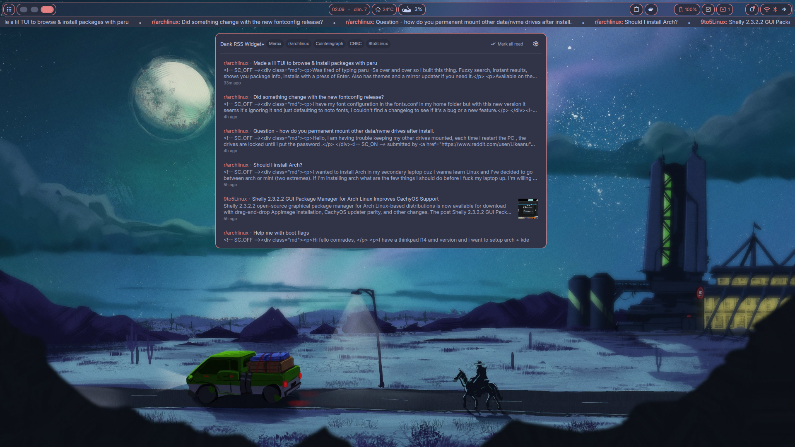
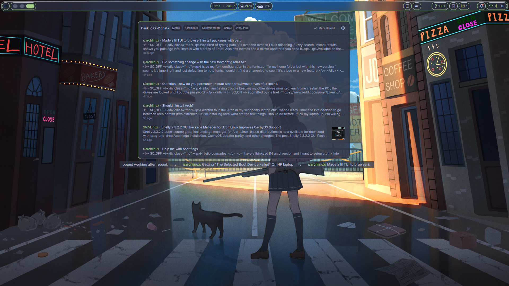
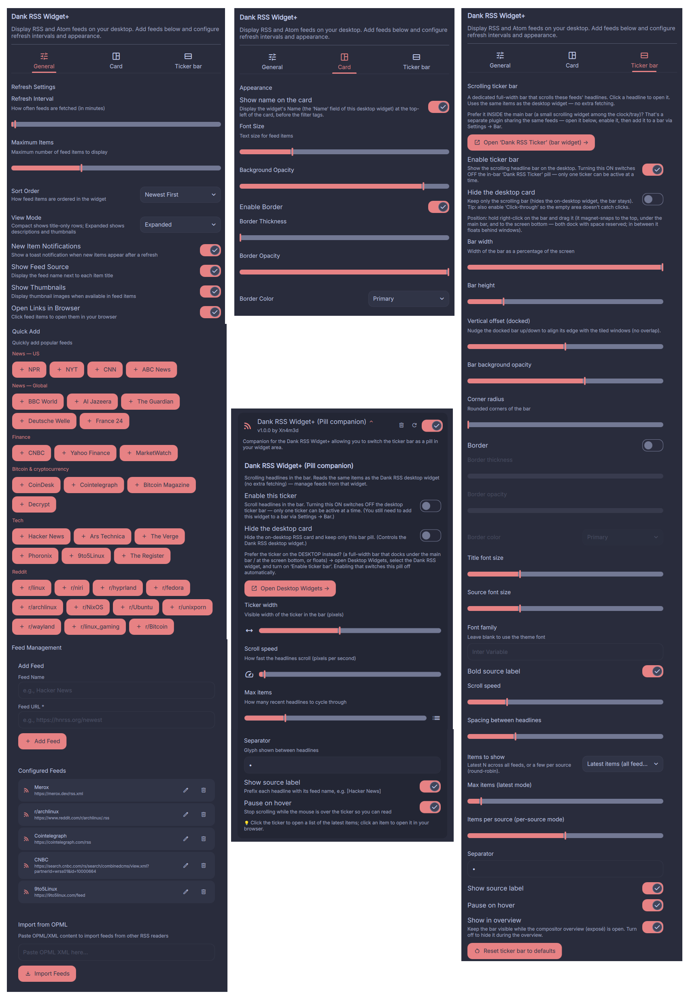
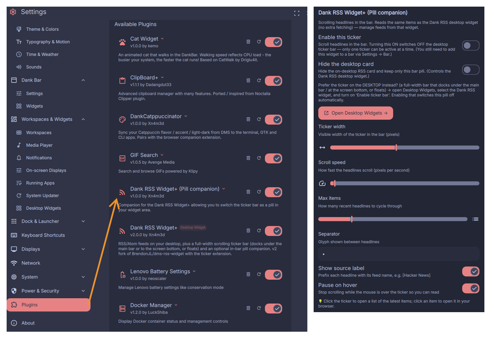

# Dank RSS Widget+ (v2)

RSS and Atom feeds for [DankMaterialShell](https://github.com/AvengeMedia/DankMaterialShell), three ways:
a desktop **card**, a full-width scrolling **ticker bar**, and an optional in-bar **pill**.

> **Fork of [`BrendonJL/dms-rss-widget`](https://github.com/BrendonJL/dms-rss-widget)** by [@Xn4m3d](https://github.com/Xn4m3d).
> v1 was BrendonJL's desktop RSS widget — all credit for the original goes to him. **v2** keeps the desktop
> card and adds a scrolling **ticker bar** (overlay) plus an optional **bar pill companion**, on top of a set
> of fixes and security hardening (the core fixes were also offered back upstream as PRs). Same MIT license.

## What's in this repo

Two DMS plugins:

| Folder | Plugin | What it is |
|--------|--------|------------|
| `dankRssWidget/` | **Dank RSS Widget+** (`desktop`) | The desktop card **and** the full-width scrolling ticker bar (overlay) |
| `dankRssTicker/` | **Dank RSS Widget+ (Pill companion)** (`widget`) | A small scrolling pill **inside** the DankBar, reading the same feeds |

Only **one** ticker can be active at a time (the desktop overlay **or** the bar pill) — enabling one
automatically disables the other.

## Features

### Desktop card
- RSS 2.0 and Atom with auto-detection, configurable refresh interval (5 min – 24 h)
- Add/edit/remove feeds, OPML import, quick-add presets (US/global news, tech, Reddit)
- Sort modes (newest / oldest / grouped by feed), compact & expanded views, thumbnails
- Read/unread tracking with mark-all, new-item toast notifications, per-source filter tags
- Optional **Name** label, appearance customization (font size, background opacity, borders)
- Settings organized in **3 tabs**: General / Card / Ticker bar

### Ticker bar — overlay (new in v2)
- Full-width scrolling headlines; reuses the card's in-memory items (no extra fetching)
- **Docks** under the main bar or at the screen bottom (reserves space, foreground), or **floats**
  anywhere in between (sits behind your windows)
- **Magnet** snap to the top/bottom edges while dragging
- Hold **right-click + drag** to move it, press **S** to toggle 100% / 50% width, with an on-screen hint
- Tunable width, horizontal position, corner radius, border, fonts, scroll speed, item spacing
- Latest-N items or per-source round-robin; click a headline to open it; pause on hover

### Bar pill — companion (new in v2)
- The same scrolling headlines as a compact widget **inside** the DankBar
- Mutually exclusive with the desktop overlay, with shortcut buttons to jump between the two settings pages

### Hardening & fixes (also offered upstream)
- 🔒 Hardened `curl` (http/https only, bounded redirects & response size, ReDoS-capped parsing,
  `isSafeUrl()` allowlist for opened links & thumbnails)
- 🩹 No blank flash on resize/recreate · 🖱️ ignores stray Niri-overview clicks · 💾 item cache for instant redraw

## Installation

Clone the repo and symlink **each plugin** you want into your DMS plugins directory:

```bash
git clone https://github.com/Xn4m3d/dms-rss-widget.git
cd dms-rss-widget

# the desktop card + ticker bar (required):
ln -s "$PWD/dankRssWidget" ~/.config/DankMaterialShell/plugins/dankRssWidget

# optional — the in-bar pill companion:
ln -s "$PWD/dankRssTicker" ~/.config/DankMaterialShell/plugins/dankRssTicker
```

Reload DMS (Ctrl+Shift+R) or restart your compositor. To use the pill, add it to a bar via
**Settings → Bar**, then enable it from its plugin settings.

## Configuration

Open **Settings → Desktop Widgets → Dank RSS Widget+** and use the tabs:

1. **General** — add feeds (or quick-add presets / OPML), refresh interval, max items, sort order, notifications
2. **Card** — name label, view mode, font size, background opacity, borders
3. **Ticker bar** — enable the overlay, width/position, height, opacity, corners, border, fonts, item mode

The pill has its own settings in **Settings → Plugins → Dank RSS Widget+ (Pill companion)**.

## Requirements

- DankMaterialShell >= 1.2.0
- `curl` (used for fetching feeds)

## Testing

The core feed-parsing logic is mirrored in a standalone JS module
(`dankRssWidget/feed-parser-tests/feed-parser.js`) so it can be unit-tested with Node.js without the QML runtime.

```bash
node --test dankRssWidget/feed-parser-tests/feed-parser.test.js
```

Requires Node.js 18+ (uses the built-in `node:test` runner). 60 tests across 9 suites cover tag
extraction, CDATA, HTML entity decoding, RSS/Atom parsing, image extraction, relative timestamps and OPML import.

## Screenshots









## License

MIT — the original work is © [@BrendonJL](https://github.com/BrendonJL) and contributors
(see the [upstream repository](https://github.com/BrendonJL/dms-rss-widget)). Changes in this
fork are released under the same MIT license.
